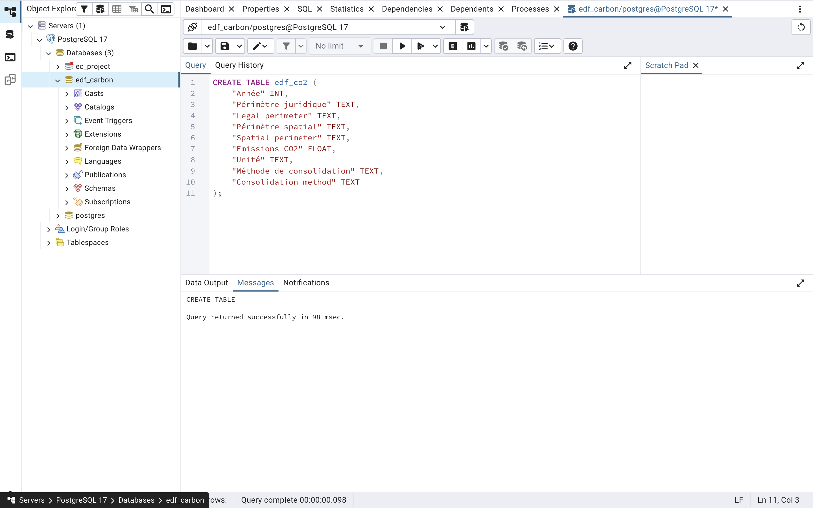
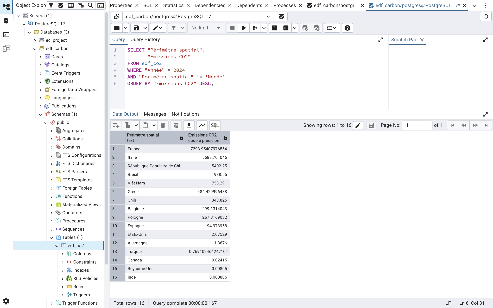
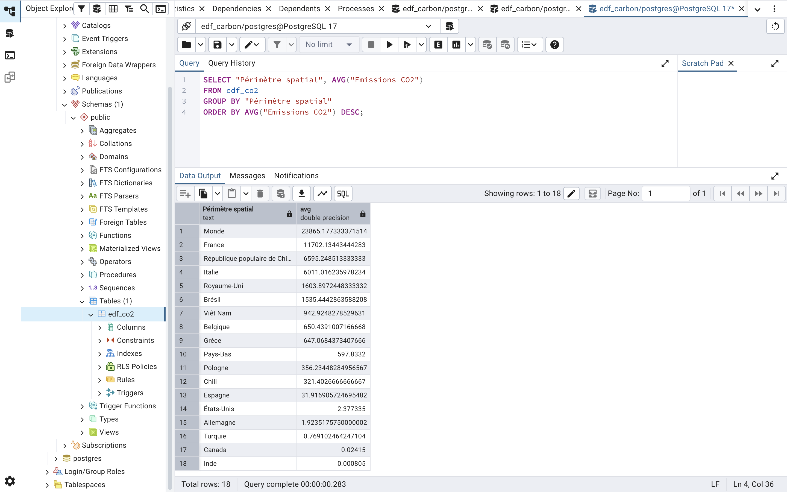

# edf-carbon-analysis

# EDF Carbon Emissions Analysis (2019–2024)

Projet d’analyse des émissions de CO₂ du groupe EDF par pays et par année, basé sur des données Open Data.

---

## Objectif du projet

Ce projet a pour objectif de :

- Analyser les émissions de CO₂ du groupe EDF
- Identifier les pays les plus émetteurs
- Étudier l’évolution des émissions dans le temps
- Illustrer une démarche complète d’analyse de données (SQL + Python + PostgreSQL)

---

## Technologies utilisées

| Outil | Utilisation |
|------|------------|
| PostgreSQL | Stockage et requêtes sur les données |
| SQL | Analyse et exploration des données |
| Python | Visualisation des données |
| GitHub | Versioning et portfolio |

---

## Architecture du projet

---

## Base de données

Les données ont été importées dans une base PostgreSQL avec la structure suivante :

```sql
CREATE TABLE edf_co2 (
    "Année" INT,
    "Périmètre juridique" TEXT,
    "Legal perimeter" TEXT,
    "Périmètre spatial" TEXT,
    "Spatial perimeter" TEXT,
    "Emissions CO2" FLOAT,
    "Unité" TEXT,
    "Méthode de consolidation" TEXT,
    "Consolidation method" TEXT
);

```
### Preuves d’exécution (PostgreSQL)

#### Création de la table


#### Import des données CSV


---

## Analyses réalisées

### 1. Évolution des émissions mondiales
Analyse de l’évolution des émissions de CO₂ du périmètre mondial sur la période 2019–2024.

#### Requêtes SQL principales
```sql
SELECT "Année",
       SUM("Emissions CO2") AS total_emissions
FROM edf_co2
WHERE "Périmètre spatial" = 'Monde'
GROUP BY "Année"
ORDER BY "Année";
```
#### Preuves d’exécution (PostgreSQL)


#### Interprétation des résultats

On observe une réduction progressive et continue des émissions de CO₂ sur l’ensemble de la période.

Cette évolution peut s’expliquer par des politiques de réduction des émissions et le renforcement des obligations de reporting carbone.

#### Conclusion

Sur la période 2019–2024, le périmètre mondial analysé montre une tendance claire à la baisse des émissions de CO₂, suggérant une amélioration progressive de la performance environnementale.

---

### 2. Top pays émetteurs (2024)
Identification des pays les plus émetteurs de CO₂ en 2024 (hors périmètre global).

### Requêtes SQL principales
```sql
SELECT "Périmètre spatial",
       "Emissions CO2"
FROM edf_co2
WHERE "Année" = 2024
AND "Périmètre spatial" != 'Monde'
ORDER BY "Emissions CO2" DESC;

```

#### Preuves d’exécution (PostgreSQL)


#### Interprétation des résultats

L’analyse des émissions de CO₂ du groupe EDF en 2024 met en évidence une forte concentration des émissions sur quelques pays clés.

La France apparaît comme le principal contributeur avec plus de 7 293 unités d’émissions, suivie par l’Italie et la Chine. Cette répartition reflète l’importance historique des activités du groupe EDF en Europe ainsi que sa présence internationale sur plusieurs marchés énergétiques.

Les émissions élevées observées en Italie et en Chine peuvent s’expliquer par :

une présence industrielle importante,
des infrastructures énergétiques plus carbonées,
ou des mix énergétiques nationaux davantage dépendants des énergies fossiles.

À l’inverse, certains pays comme le Royaume-Uni, le Canada ou l’Inde présentent des niveaux d’émissions très faibles dans le périmètre EDF, ce qui peut traduire :

une présence plus limitée du groupe,
des activités moins intensives en carbone,
ou un portefeuille énergétique davantage orienté vers des énergies bas carbone.

#### Conclusion

Globalement, les résultats montrent que les émissions carbone du groupe EDF ne sont pas réparties uniformément entre les différents pays d’implantation. Quelques zones géographiques concentrent une part majeure des émissions totales du groupe.

### 3. France vs Monde
Comparaison des émissions de la France par rapport au total mondial afin d’analyser son poids relatif.

#### Requêtes SQL principales
```sql
SELECT "Année",
       "Périmètre spatial",
       "Emissions CO2"
FROM edf_co2
WHERE "Périmètre spatial" IN ('France', 'Monde')
ORDER BY "Année"; 
```
#### Preuves d’exécution (PostgreSQL)
 
FROM edf_co2
GROUP BY "Périmètre spatial"
ORDER BY AVG("Emissions CO2") DESC;

```
#### Preuves d’exécution (PostgreSQL)


### 5. Évolution dans le temps

#### Requêtes SQL principales
```sql
SELECT "Année", SUM("Emissions CO2")
FROM edf_co2
GROUP BY "Année"
ORDER BY "Année";
```
#### Preuves d’exécution (PostgreSQL)

### 6. Top 10 pays émetteurs

#### Requêtes SQL principales
```sql
SELECT "Périmètre spatial", SUM("Emissions CO2")
FROM edf_co2
GROUP BY "Périmètre spatial"
ORDER BY SUM("Emissions CO2") DESC
LIMIT 10;
```
#### Preuves d’exécution (PostgreSQL)


---

## Résultats clés

- Les émissions sont concentrées sur quelques pays majeurs
- Tendance mondiale globalement baissière
- France et Italie figurent parmi les principaux contributeurs
- Variabilité importante selon les zones géographiques
